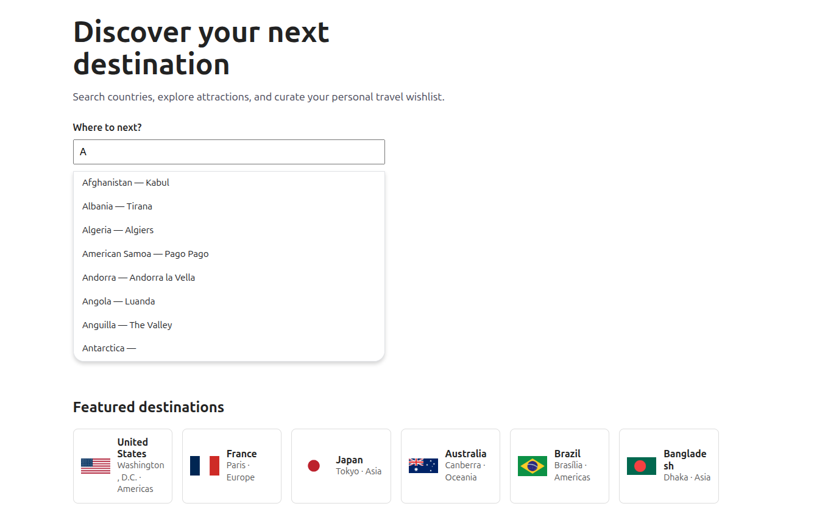
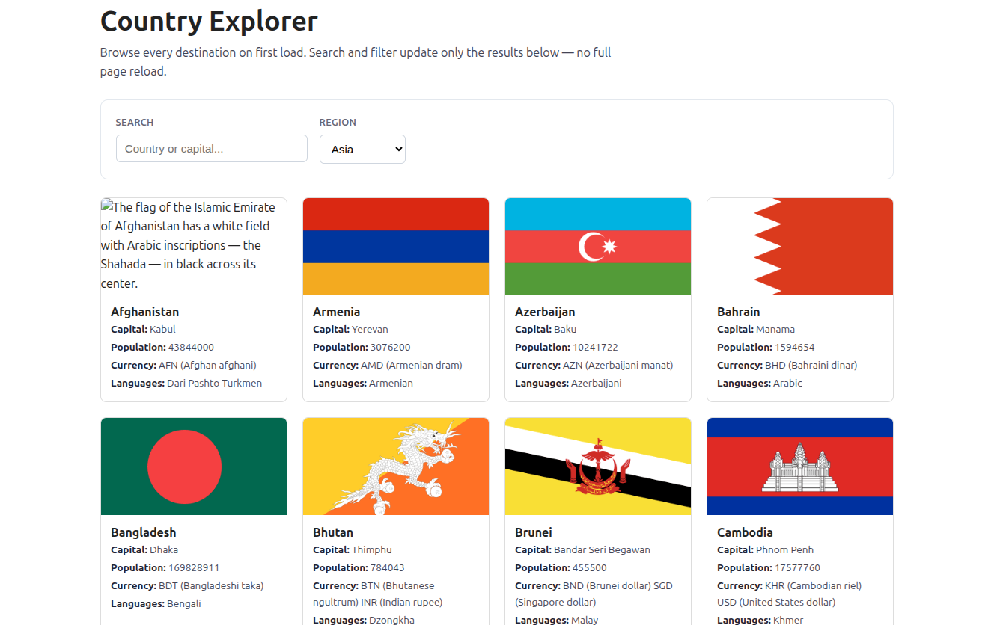
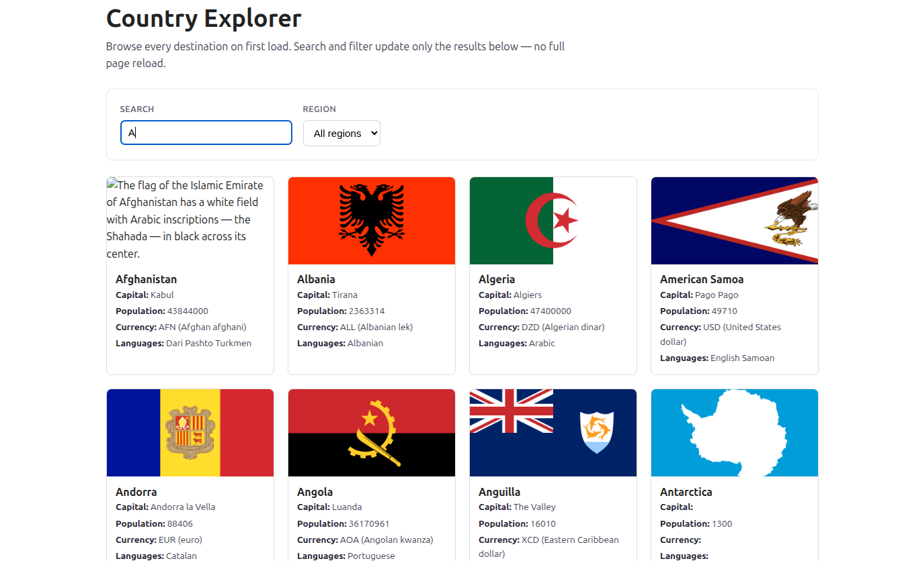
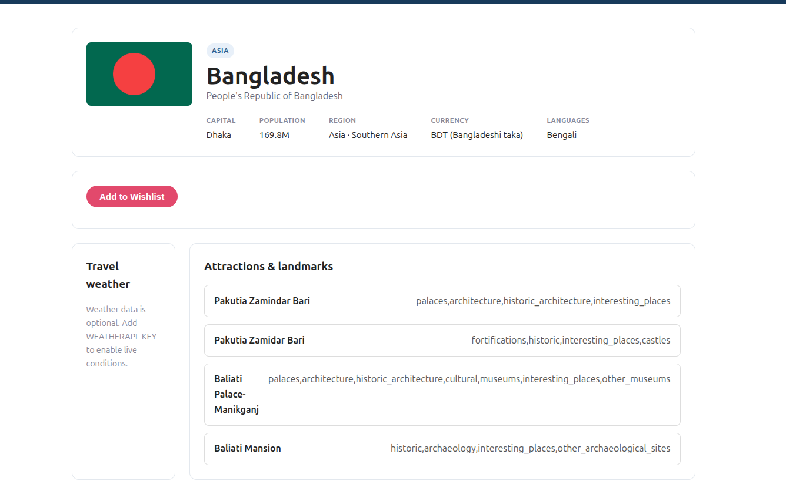
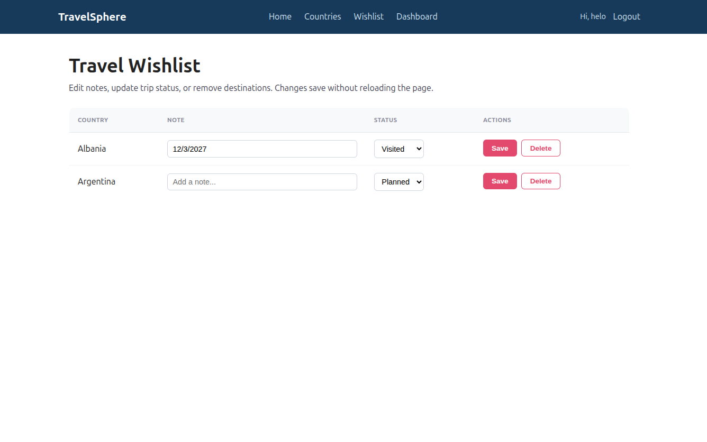
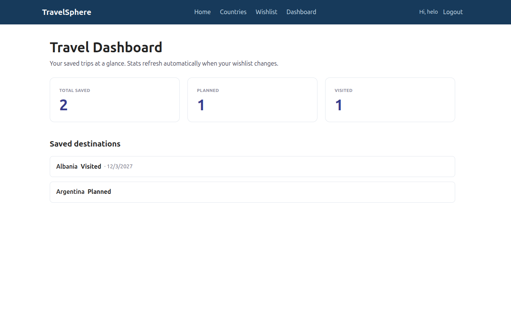

# TravelSphere

A destination discovery and trip-planning app built with the Beego framework (Go). You can browse countries, dig into a destination's details and nearby attractions, and keep a personal travel wishlist with planned/visited status.

Built as a full-stack Beego MVC app: server-rendered pages for navigation, a separate JSON API for the dynamic bits, and AJAX so searching and editing your wishlist never reload the page.

## What it does

- Browse and search countries (data from the REST Countries API)
- Filter the country list by region
- View a country's detail page with flag, population, currency, languages, and nearby attractions (from OpenTripMap)
- Save destinations to a wishlist, add notes, and mark them Planned or Visited
- A dashboard with at-a-glance counts of your saved/planned/visited trips
- Register and log in — the wishlist and dashboard are per-user and require a session

## Tech

- **Beego v2** (`github.com/beego/beego/v2`)
- Go 1.21+
- REST Countries and OpenTripMap for external data
- bcrypt for password hashing
- File-based JSON storage (no database)

## Project layout

```
controllers/        SSR page controllers (home, country, wishlist, dashboard, auth)
controllers/api/    JSON API controllers (countries, wishlist CRUD, dashboard summary)
filters/            Logging filter + auth filters (SSR redirect / API 401)
services/           Business logic — orchestrates the API clients and storage
utils/              Reusable API clients, validation, formatting, error helpers
models/             Domain structs and Data transfer objects
routers/            Route registration (SSR routes and /api routes kept separate)
views/              Beego templates: layout, header/footer partials, page templates
static/             CSS and the vanilla-JS files that drive the AJAX
data/               Runtime JSON storage (created automatically, gitignored)
```

The split is deliberate: controllers stay thin and just parse requests and hand off to `services`, which hold the logic and talk to the clients in `utils`. SSR controllers render templates; API controllers return JSON. Nothing in `/api/*` returns HTML and no page route returns JSON.

## Setup

### 1. Prerequisites

- Go 1.21 or newer
- The Beego CLI (`bee`) is handy for development but not required:
  ```
  go install github.com/beego/bee/v2@latest
  ```

### 2. Clone and install dependencies

```
git clone <your-repo-url>
cd TravelSphere
go mod download
```

### 3. Configure API keys

The app reads configuration from `conf/app.conf`. A sample is committed as `conf/app.conf.sample` — copy it and fill in your key:

```
cp conf/app.conf.sample conf/app.conf
```

Then set the OpenTripMap key in `conf/app.conf`:

```ini
appname = TravelSphere
httpport = 8080
runmode = dev
OPENTRIPMAP_API_KEY=your_api_key
sessionon = true
copyrequestbody = true
```

**REST Countries:** no key needed — it's a free, public API.

`conf/app.conf` is gitignored so your key never gets committed. The committed `conf/app.conf.sample` documents what's expected.

### 4. Run it

```
bee run
```

or without the CLI:

```
go run main.go
```

Then open http://localhost:8080.

## Using the app

1. **Register** at `/register` (or log in at `/login` if you already have an account). The wishlist and dashboard are protected — you'll be redirected to login if you try to reach them without a session.
2. **Browse** countries at `/countries`. Type in the search box or pick a region — the results update in place without a page reload.
3. **Open** a country, e.g. `/countries/japan`, to see its details and attractions.
4. **Add to Wishlist** from the detail page. The button updates with a confirmation; no reload.
5. **Manage** your list at `/wishlist` — edit notes, change status, or delete rows, all inline.
6. **Check** `/dashboard` for your totals.

### Slug format

Country detail routes use a lowercase, hyphenated version of the country's common name:

- `/countries/japan`
- `/countries/united-states`
- `/countries/bangladesh`

## AJAX behavior

Every dynamic interaction updates only a section of the page — the header, nav, and footer never reload. Each one calls a JSON API endpoint and swaps the contents of a single target container:

| Page | Action | Endpoint | What updates |
|------|--------|----------|--------------|
| `/countries` | Search / region filter | `GET /api/countries` | `#country-results` only |
| `/` | Search autocomplete | `GET /api/countries` | `#search-suggestions` only |
| `/countries/:slug` | Add to Wishlist | `POST /api/wishlist` | `#wishlist-feedback` only |
| `/wishlist` | Edit note / change status | `PUT /api/wishlist/:id` | the affected row |
| `/wishlist` | Delete | `DELETE /api/wishlist/:id` | the affected row |
| `/dashboard` | Refresh stats | `GET /api/dashboard/summary` | `#dashboard-stats` only |

The only full-page navigation in the country flow is clicking a country card, which goes to the SSR detail route `/countries/:slug` as a normal link. Searching and filtering never trigger a reload — they fetch JSON and rebuild the results container in place, with a loading state shown while the request is in flight. Errors are shown inside the same container rather than redirecting.

The country explorer and wishlist pages are also fully server-rendered on first load, so they work with JavaScript disabled — the AJAX is progressive enhancement on top of working HTML.

## Screenshots

### Home


### Country Explorer




### Destination Detail


### Wishlist


### Dashboard


## Routes

### SSR pages (HTML)

| Method | Route | Description |
|--------|-------|-------------|
| GET | `/` | Home with featured countries and search |
| GET | `/countries` | Country explorer (server-rendered list + search/filter UI) |
| GET | `/countries/:slug` | Country detail page |
| GET | `/wishlist` | Wishlist (requires login) |
| GET | `/dashboard` | Dashboard (requires login) |
| GET/POST | `/login` | Login form / submit |
| GET/POST | `/register` | Register form / submit |
| GET | `/logout` | Clear session |

### JSON API

| Method | Route | Description |
|--------|-------|-------------|
| GET | `/api/countries` | Country list, supports `?search=` and `?region=` |
| GET | `/api/wishlist` | Current user's wishlist |
| GET | `/api/wishlist/:id` | A single wishlist item |
| POST | `/api/wishlist` | Create an item |
| PUT | `/api/wishlist/:id` | Update note/status |
| DELETE | `/api/wishlist/:id` | Delete an item |
| GET | `/api/dashboard/summary` | Wishlist counts (total/planned/visited) |

## Wishlist storage

Storage is **file-based JSON**, not a database — wishlist entries live in `data/wishlist.json` and users in `data/users.json`. The wishlist service reads and writes through a small storage adapter in `utils`, treating the file I/O the same way it treats the external API clients. File access is guarded by a mutex so concurrent requests can't corrupt the file, and the `data/` directory is created automatically on first write.

Each wishlist item has: `id`, `username` (owner), `country_name`, `note`, `status` (Planned or Visited), and `created_at`. Required fields and the status value are validated before anything is written.

### Why file-based JSON

The assessment ruled out databases and offered three storage options: in-memory, file-based JSON, or a mock external API. File-based JSON was the best fit here for a few reasons:

- **Data survives restarts.** Unlike an in-memory store, a saved wishlist is still there after the server stops and starts again — which makes the app actually usable and easier to demo.
- **It fits the adapter pattern cleanly.** The spec suggested treating file I/O as an API adapter rather than a database layer. Wrapping reads and writes behind a small storage utility mirrors how the REST Countries and OpenTripMap clients work, so the service layer talks to all three the same way.
- **No extra moving parts.** It needs no mock server to spin up and no schema or migrations — the evaluator can clone and run with nothing beyond the API key, and the stored data is human-readable JSON if anyone wants to inspect it.

The trade-off is that whole-file read/write doesn't scale to large datasets or heavy concurrent writes — for a personal wishlist that's a non-issue, but a real product would move to a proper database.

## Tests [Coverage: 88.9%]

Run the full suite:

```
go test ./...
```

The tests mock all external APIs (REST Countries, OpenTripMap) using local test servers, so they don't depend on network access or live API availability — they pass offline. File-backed stores are redirected to temp files during tests, so running the suite never touches your real `data/` files.

For a coverage report:

```
go test ./... -coverprofile=cov.out
go tool cover -func=cov.out
```

Coverage spans the services, utilities, controllers, API handlers, and filters.

![Test Coverage[88.9%]](docs/test_coverage.png)

## Run With Docker Desktop

Make sure Docker Desktop is running, then open PowerShell in the project folder:

```powershell
cd D:\TravelSphere
```

Build the Docker image:

```powershell
docker build -t travelsphere .
```

Run the container:

```powershell
docker run -d --name travelsphere -p 8080:8080 travelsphere
```

Open the app in your browser:

```text
http://localhost:8080
```

If port `8080` is already in use, remove the failed container and run it on another local port:

```powershell
docker rm travelsphere
docker run -d --name travelsphere -p 8081:8080 travelsphere
```

Then open:

```text
http://localhost:8081
```

Useful Docker commands:

```powershell
docker ps
docker logs -f travelsphere
docker stop travelsphere
docker rm travelsphere
```

The Dockerfile exposes port `8080` inside the container. The `-p 8081:8080` format means local port `8081` maps to container port `8080`.

## Notes and limitations

- **Weather is not implemented.** The detail page has a weather panel as a placeholder, but the WeatherAPI integration was left out of scope — the panel shows a fallback message. It's wired as an optional bonus only.
- The featured countries on the home page are fetched one-by-one from REST Countries on each load. For a production app this is the obvious caching candidate; for this scope it's left simple.
- External API failures are handled gracefully — a slow or down API shows a fallback message rather than crashing the page.
- No database is used or required, by design.
```

